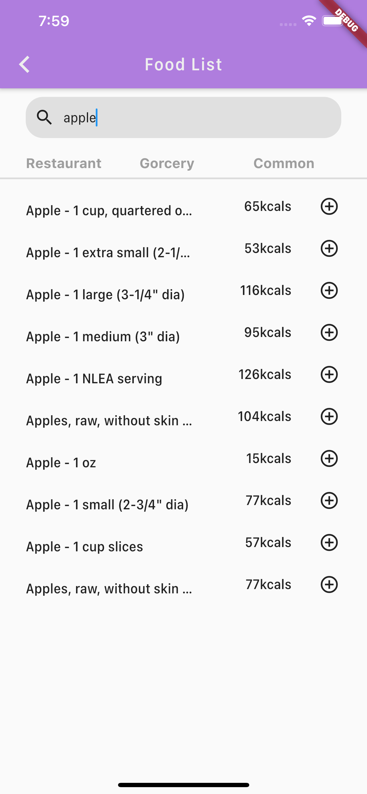
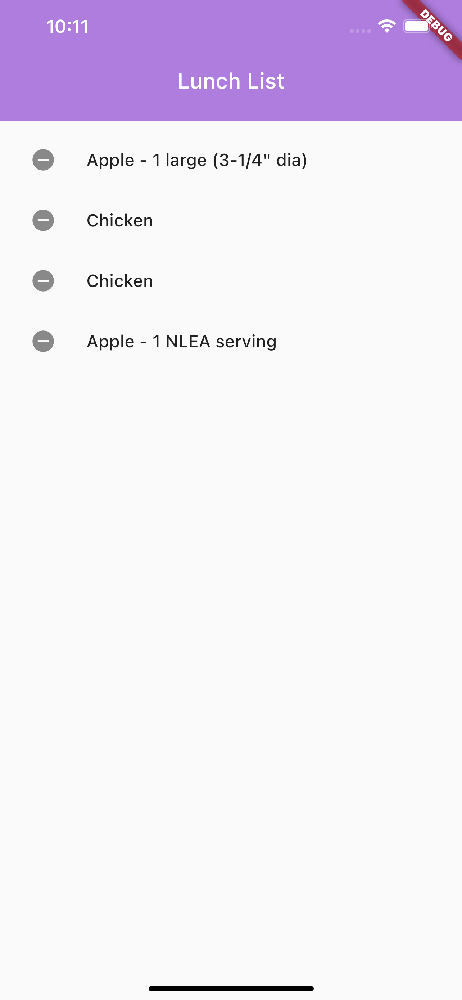
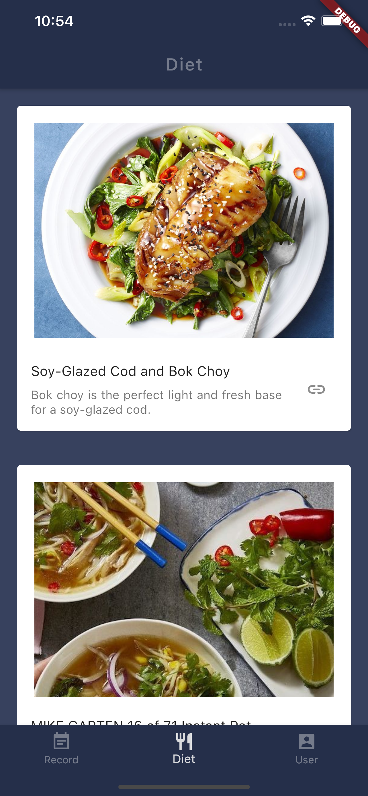
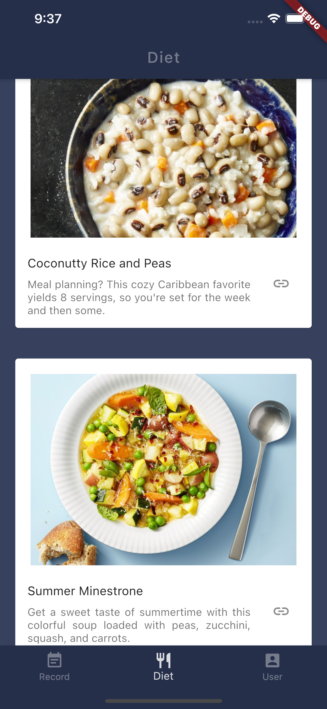

# Dieta

Dieta has the following features:

💻 Calories Counter
🍜 Food Database
📅 Daily Records
🏃‍♀️ Steps Counter
📈 Customized Diet Plans
🔔 Sweet Notifications

# Home Screen

Display calories information

# Food Screen

Provide a full food-list by using NutritioniX API

# Diet Screen

Recommend Diets

# Settings Screen

User Profile and Settings

