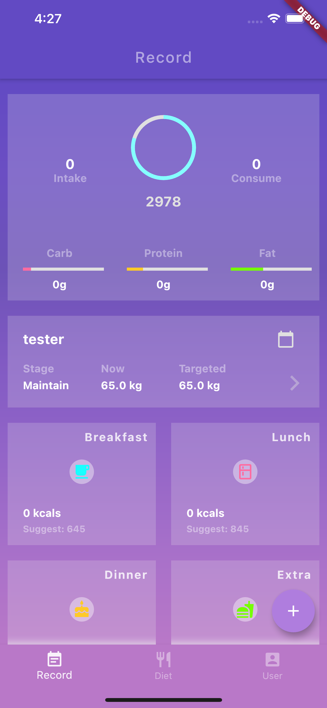
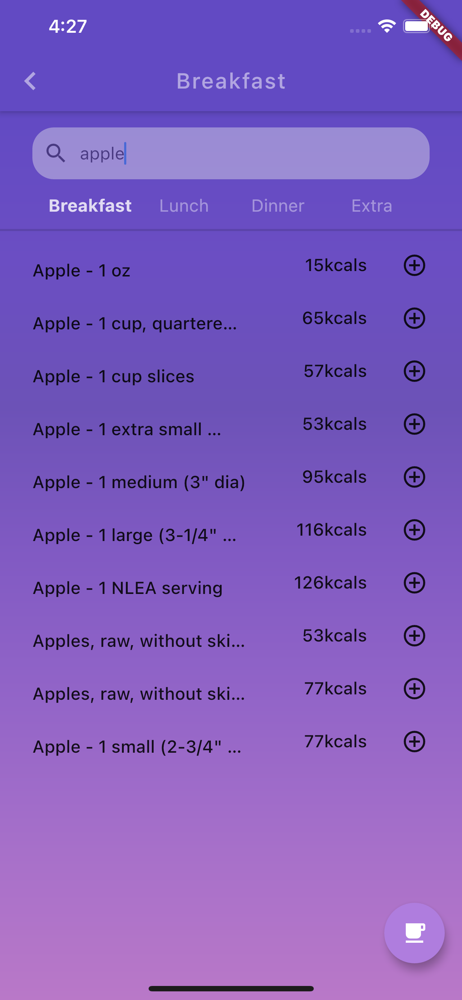
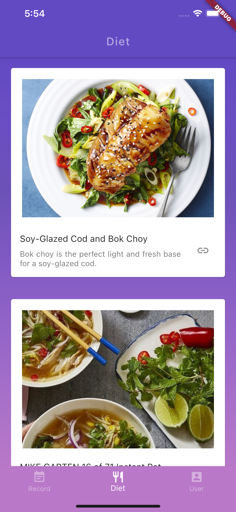
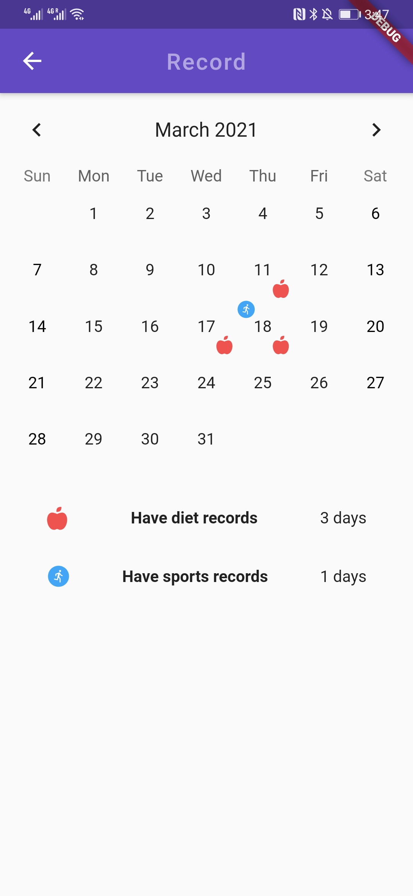
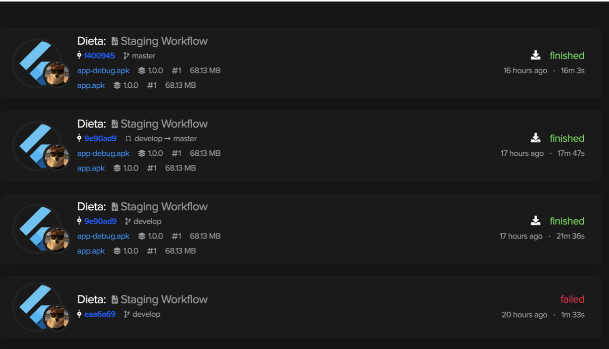
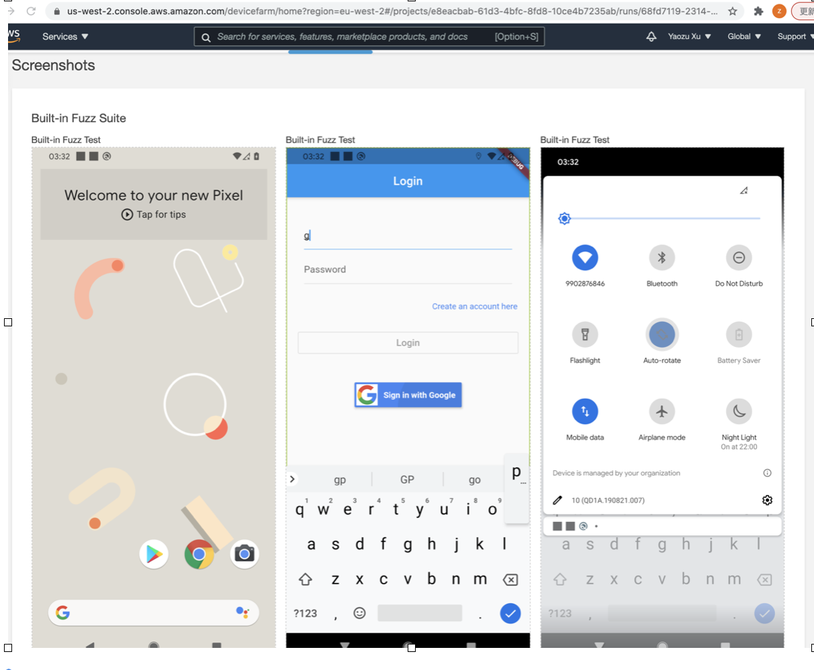

# Dieta

Dieta has the following features:

💻 Calories Counter 

🍜 Food Database 

📅 Daily Records 

🏃‍♀️ Steps Counter 

📈 Customized Diet Plans 

🔔 Sweet Notifications

# Home Screen

Display calories information

# Food Screen

Provide a full food-list by using NutritioniX API

# Diet Screen

Recommend Diets

# Calendar Screen

Historical Data 

# Settings Screen

User Profile and Settings

 

# CI/CD

## Codemagic 

 
 

## Sylph && AWS Device Farm

